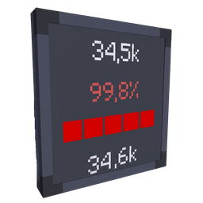

# 📊 Create: Info Display (Storage Panels)

<p align="center">
  
</p>

<p align="center">
  <a href="https://opensource.org/licenses/MIT"></a>
  
  <a href="https://neoforged.net/"></a>
  <a href="https://modrinth.com/mod/create"></a>
  
</p>

<p align="center">
  <b>Настенные информационные панели для хранилищ мода Create в реальном времени.</b><br>
  <i>Real-time in-world status display panels for Create Item Vaults & Fluid Tanks.</i>
</p>

---

## 🇷🇺 Описание на русском

**Info Display** — аддон для мода **[Create](https://modrinth.com/mod/create)**, добавляющий два типа компактных информационных панелей-экранов: для сейфов предметов (**Item Vault**) и резервуаров жидкостей (**Fluid Tank**).

Панели монтируются на любую сторону блока и в реальном времени отображают точные показатели хранилища прямо в игровом мире без необходимости открывать интерфейс или держать в руках очки инженера.

---

### 🌟 Основные блоки и возможности

#### 📦 1. Панель хранилища (Storage Panel)
Устанавливается на **Item Vault** (или Item Silo из *Create: Connected*) задней частью:
* 🔢 **Точное количество предметов**: показывает текущее число предметов и максимальную вместимость сейфа.
* 📈 **Процент заполнения**: четкий цифровой индикатор процента.
* 🎨 **Цветовой прогресс-бар**: наглядная шкала заполнения, меняющая цвет по мере наполнения (`Зелёный ➔ Жёлтый ➔ Красный`).
* 🧱 **Поддержка мультиблоков**: корректно считывает суммарную вместимость сейфов любого размера (1x1x1, 3x3x9 и др.).

#### 💧 2. Жидкостная панель (Fluid Panel)
Устанавливается на **Fluid Tank** задней частью:
* 🧪 **Название жидкости**: локализованное имя содержащейся жидкости.
* 🪣 **Объём в милливедрах (mB)**: текущий уровень и общий объём резервуара.
* 📊 **Шкала и процент**: динамический прогресс-бар уровня жидкости.
* 🌐 **Поддержка мультиблочных цистерн**: автоматический учет суммарного объёма объединенных цистерн.

---

### 📐 Универсальное размещение (6 направлений)

Панели обладают полной свободой установки:
* 🧱 **Стены**: смотрит в любую из 4 горизонтальных сторон (Север, Юг, Восток, Запад).
* ⬇️ **Пол**: лежит горизонтально, экран направлен вверх.
* ⬆️ **Потолок**: крепится сверху, экран направлен вниз.
* 🌊 **Под водой (Waterloggable)**: полная поддержка затопления водой без разрушения блока.
* 🔧 **Гаечный ключ (Wrench)**: правый клик поворачивает панель, `Shift + ПКМ` мгновенно демонтирует в инвентарь.

> **Принцип работы**: панель всегда считывает данные из хранилища, находящегося **строго позади неё** (противоположно лицевой стороне экрана).

---

## 🇬🇧 English Description

**Info Display** is an addon for **[Create](https://modrinth.com/mod/create)** that introduces in-world display panels for monitoring **Item Vaults** and **Fluid Tanks** at a glance.

Place them directly on vault/tank surfaces to get instant telemetry on item quantities, fluid levels, capacities, and color-coded progress bars without opening GUIs or wearing Engineer's Goggles.

---

### 🌟 Features

#### 📦 1. Storage Panel
Connects to a **Create Item Vault** (or **Create: Connected Item Silo**) placed directly behind it:
* 🔢 **Live Item Count**: Displays current total stored items vs. max vault capacity.
* 📈 **Percentage Indicator**: Real-time fill percentage.
* 🎨 **Dynamic Color Progress Bar**: Visual gauge transitioning smoothly from Green ➔ Yellow ➔ Red as storage approaches capacity.
* 🧱 **Multi-block Ready**: Seamlessly aggregates capacity across multi-block vaults of any dimension.

#### 💧 2. Fluid Panel
Connects to a **Create Fluid Tank** placed directly behind it:
* 🧪 **Fluid Identification**: Shows localized name of the contained liquid.
* 🪣 **Capacity in mB**: Displays volume in millibuckets alongside total tank capacity.
* 📊 **Progress Bar**: Responsive visual level indicator.
* 🌐 **Multi-block Fluid Networks**: Automatically binds to merged fluid tanks.

---

### 📐 Placement & Mechanics

* 🧱 **Wall Mount**: Faces any of the 4 cardinal directions.
* ⬇️ **Floor Mount**: Lies flat, readable from above.
* ⬆️ **Ceiling Mount**: Hangs overhead, readable from below.
* 🌊 **Waterloggable**: Can be placed underwater without issue.
* 🔧 **Create Wrench Interaction**: Right-click to cycle rotation; `Shift + Right-Click` to pick up.

---

## 📋 Требования / Requirements

| Мод / Dependency | Версия / Version | Назначение / Purpose |
|------------------|------------------|----------------------|
| **Minecraft**    | `1.21.1`         | Game Base |
| **NeoForge**     | `21.1.219+`      | Mod Loader |
| **Create**       | `6.0.0+`         | Core Requirement |
| **Create: Connected** *(Опционально)* | `*` | Поддержка Item Silo |

---

## 🛠️ Совместимость / Compatibility

* ✅ Любые мультиблочные Item Vaults мода Create
* ✅ Хранилища **Item Silo** из аддона *Create: Connected*
* ✅ Любые мультиблочные Fluid Tanks
* ✅ Добывается киркой (Mineable with pickaxe)
* ✅ Поддержка рецептов в JEI / REI / EMI

---

## 💻 Сборка из исходников / Building from Source

```bash
# Клонируйте репозиторий
git clone https://github.com/PerfLite/CreateAddon_Storage_Panel.git
cd CreateAddon_Storage_Panel

# Сборка проекта (требуется Java 21)
./gradlew build
```
Готовый `.jar` файл будет скомпилирован в папке `build/libs/`.

---

## 📄 Лицензия / License

Проект лицензирован под **[MIT License](LICENSE)**. Разрешено свободное использование в модпаках, сборках и модификациях.
